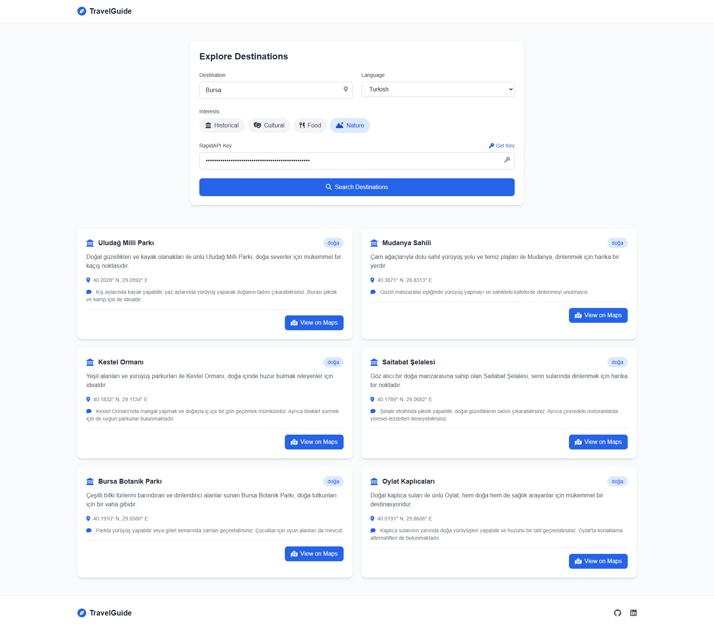

# AI Travel Guide 🌍

A modern web application that helps users discover travel destinations with AI-powered recommendations. Built with modern web technologies and integrated with RapidAPI's travel guide service.

## 🌟 Features

- 🔍 Search destinations worldwide
- 🗣️ Multi-language support
- 🎯 Interest-based filtering (Historical, Cultural, Food, Nature)
- 📍 Google Maps integration
- 🔄 State persistence via URL
- 📱 Responsive design
- 🌓 Modern UI with Tailwind CSS

## 🛠️ Technologies Used

- HTML5
- JavaScript (Vanilla)
- Tailwind CSS
- Font Awesome Icons
- RapidAPI Integration

## 📋 Prerequisites

To use this application, you'll need:

1. A RapidAPI account
2. An API key from [Travel Guide API](https://rapidapi.com/bilgisamapi-bilgisamapi-default/api/travel-guide-api-city-guide-top-places)

## 🔑 API Integration

The application uses the Travel Guide API from RapidAPI. To get started:

1. Sign up on [RapidAPI](https://rapidapi.com)
2. Subscribe to the [Travel Guide API](https://rapidapi.com/bilgisamapi-bilgisamapi-default/api/travel-guide-api-city-guide-top-places)
3. Copy your API key
4. Paste the API key in the application

## 💡 Usage

1. Enter your desired destination
2. Select your preferred language
3. Choose your interests (Historical, Cultural, Food, Nature)
4. Enter your RapidAPI key
5. Click "Search Destinations"
6. View results and click "View on Maps" to see locations on Google Maps

## 🔗 State Management

The application features URL-based state management:
- All form inputs and search results are encoded in the URL
- Share your search results by sharing the URL
- State persists across page reloads

## 📱 Responsive Design

The application is fully responsive and works on:
- 💻 Desktop computers
- 📱 Mobile devices
- 📟 Tablets
